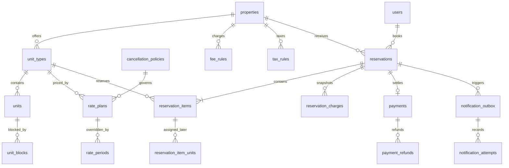

# PostgreSQL and DBeaver setup

The application and DBeaver connect to the same PostgreSQL server. DBeaver is only the desktop administration client; PostgreSQL stores the data.

## Development connection

Create the application role while connected to the default `postgres` database as the PostgreSQL administrator. Substitute your own local password; do not commit it.

```sql
DO $$
BEGIN
  IF EXISTS (SELECT 1 FROM pg_roles WHERE rolname = 'evolyst_dev') THEN
    ALTER ROLE evolyst_dev
      WITH LOGIN NOSUPERUSER NOCREATEDB NOCREATEROLE
      PASSWORD '<local-password>';
  ELSE
    CREATE ROLE evolyst_dev
      WITH LOGIN NOSUPERUSER NOCREATEDB NOCREATEROLE
      PASSWORD '<local-password>';
  END IF;
END
$$;
```

Create the database only if it does not already exist. `CREATE DATABASE` must run with auto-commit enabled, outside a transaction.

```sql
CREATE DATABASE evolyst_dev
  WITH OWNER = evolyst_dev
  ENCODING = 'UTF8'
  TEMPLATE = template0;
```

Configure `.env.local`:

```dotenv
DATABASE_URL=postgresql://evolyst_dev:<url-encoded-local-password>@localhost:5432/evolyst_dev
DATABASE_SSL=disable
DATABASE_POOL_MAX=5
DATABASE_CONNECTION_TIMEOUT_MS=10000
DATABASE_STATEMENT_TIMEOUT_MS=15000
DATABASE_IDLE_TRANSACTION_TIMEOUT_MS=15000
HOLD_SWEEP_INTERVAL_MS=30000
HOLD_SWEEP_BATCH_SIZE=100
```

Percent-encode special password characters in the URL. Never commit `.env.local`.

## Development and production separation

Use separate databases, roles, passwords, backups, and connection URLs:

| Environment | Database       | User           | Host                    | Configuration             |
| ----------- | -------------- | -------------- | ----------------------- | ------------------------- |
| Development | `evolyst_dev`  | `evolyst_dev`  | `localhost`             | `.env.local`              |
| Production  | `evolyst_prod` | `evolyst_prod` | managed production host | encrypted hosting secrets |

Never point a local build at production. The committed `.env.production.example` contains placeholders only.

## Migrate and seed

```bash
npm run db:validate
npm run db:migrate
npm run db:seed
npm run db:status
```

- `db:validate` checks migration structure without changing the database.
- `db:migrate` applies each migration once and records its SHA-256 checksum.
- `db:seed` safely upserts users, amenities, demo properties, public room types, private physical rooms, rate plans, taxes, fees, cancellation policies, and date-range room blocks.
- `db:status` reports the server, migrations, and core record counts.

Applied migration files are immutable. Add a new numbered migration for every later schema change.

## DBeaver

Choose **Database → New Database Connection → PostgreSQL**:

| Field           | Value                   |
| --------------- | ----------------------- |
| Connection name | `Evolyst - DEV`         |
| Host            | `localhost`             |
| Port            | `5432`                  |
| Database        | `evolyst_dev`           |
| Username        | `evolyst_dev`           |
| Password        | the local role password |
| SSL             | disabled locally        |

Select **Test Connection**, then expand `Evolyst - DEV → Schemas → aureum → Tables`.

## Inventory model

There is intentionally no `availability` table. Persisting one row for every property/date becomes large, easy to desynchronize, and difficult to maintain.



- `unit_types` are customer-visible choices such as “Skyline King Room.”
- `units` are staff-only physical rooms such as `KL-201`; their IDs and internal codes never appear in public payloads.
- `unit_blocks` store half-open date ranges for maintenance, owner use, housekeeping, or channel holds.
- `reservation_items` allow multiple room quantities and mixed room types in one reservation.
- `rate_plans`, `rate_periods`, `fee_rules`, `tax_rules`, and `cancellation_policies` keep pricing normalized while reservations retain immutable price/policy snapshots.
- `payments` stores provider state and monetary amounts in minor units; `payment_refunds` supports idempotent full and partial refunds.
- `payment_webhook_events` deduplicates signed provider events and stores payload hashes rather than raw payment payloads.
- `notification_outbox` atomically records confirmation, reminder, cancellation, and administrator emails without sending inside booking transactions.
- `notification_attempts` retains immutable send outcomes while workers use row locking, stale-claim recovery, provider idempotency, and bounded retry.
- computed inventory is operational physical rooms minus overlapping blocks, confirmed reservations, and unexpired pending holds.

Booking transactions lock selected room types in deterministic order, then recompute every requested night. This permits concurrent bookings for unrelated room types while preventing overselling. PostgreSQL range/GiST constraints reject overlapping operational blocks and active physical-room assignments.

## Hold expiry

Run `npm run worker:holds` as a separate long-lived process in production. It claims expired pending reservations with `FOR UPDATE SKIP LOCKED`, marks them cancelled, and writes audit records. Multiple instances can run safely. Inventory calculations also ignore a pending hold as soon as its timestamp expires, independent of worker timing.
